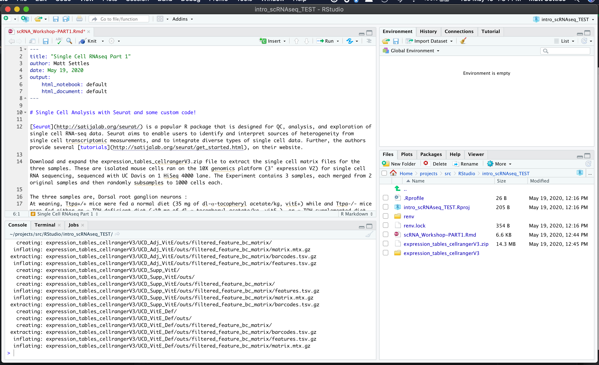

# Create a new RStudio project

Open RStudio and create a new project, for more info see [Using-Projects](https://support.rstudio.com/hc/en-us/articles/200526207-Using-Projects)

File > New Project > New Directory > New Project (name the new directory, Ex. Differential_Expression) and check “use renv with this project” if present.
Learn more about [renv](https://rstudio.github.io/renv/articles/renv.html)

Set some options and make sure the packages Seurat, sva, ggplot2, dplyr, limma, topGO, WGCNA are installed (if not install it), and then load them and verify they all loaded correctly.

In the R console run the following commands, it is helpful to run one package at a time

```
if (!any(rownames(installed.packages()) == "dplyr")){
  if (!requireNamespace("BiocManager", quietly = TRUE))
      install.packages("BiocManager")
  BiocManager::install("dplyr")
}
library(dplyr)

if (!any(rownames(installed.packages()) == "qqman")){
  if (!requireNamespace("BiocManager", quietly = TRUE))
      install.packages("BiocManager")
  BiocManager::install("qqman")
}
library(qqman)

if (!any(rownames(installed.packages()) == "CMplot")){
  if (!requireNamespace("BiocManager", quietly = TRUE))
      install.packages("BiocManager")
  BiocManager::install("CMplot")
}
library(CMplot)

if (!any(rownames(installed.packages()) == "ggplot2")){
  if (!requireNamespace("BiocManager", quietly = TRUE))
      install.packages("BiocManager")
  BiocManager::install("ggplot2")
}
library(ggplot2)


if (!any(rownames(installed.packages()) == "kableExtra")){
  if (!requireNamespace("BiocManager", quietly = TRUE))
      install.packages("BiocManager")
  BiocManager::install("kableExtra")
}
library(kableExtra)


if (!any(rownames(installed.packages()) == "rmarkdown")){
  if (!requireNamespace("BiocManager", quietly = TRUE))
      install.packages("BiocManager")
  BiocManager::install("rmarkdown")
}
library(rmarkdown)

if (!any(rownames(installed.packages()) == "tinytex")){
  if (!requireNamespace("BiocManager", quietly = TRUE))
      install.packages("BiocManager")
  BiocManager::install("tinytex")
}
library(tinytex)
```


### Download the template Markdown workshop document PART1 and open it.
In the R console run the following command
```
download.file("https://raw.githubusercontent.com/ucdavis-bioinformatics-training/2021-July-Genome-Wide-Association-Studies/main/data_analysis/GWASvisualizations.Rmd",
 "GWASvisualization.Rmd")

```
Open that file.


### Download the data for the workshop, extract it.
In the R console run the following command.
```
download.file("https://raw.githubusercontent.com/ucdavis-bioinformatics-training/2021-July-Genome-Wide-Association-Studies/main/datasets/query.output.genome_summary.csv", "query.output.genome_summary.csv")
```

```
download.file("https://raw.githubusercontent.com/ucdavis-bioinformatics-training/2021-July-Genome-Wide-Association-Studies/main/datasets/tdtadj.csv", "tdtadj.csv")
```

```
download.file("https://raw.githubusercontent.com/ucdavis-bioinformatics-training/2021-July-Genome-Wide-Association-Studies/main/datasets/tdtfrq.csv", "tdtfrq.csv")
```

Your RStudio should look something like this



