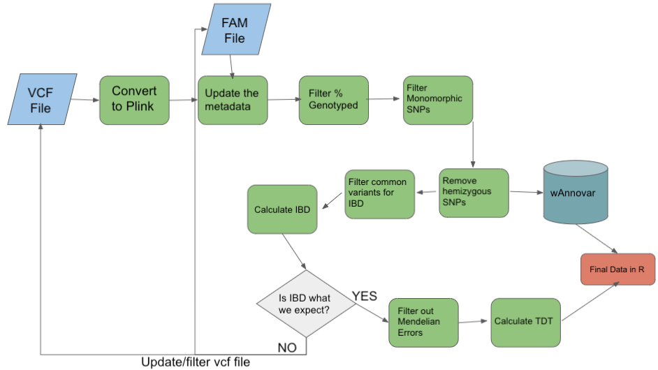

# Plink Step by Step for non FBAT (family based association test)

- This section assumes that Plink Step By Step has already been completed.
- Rather then spend all of our time on family based studies I would like to give you all an idea of the differences between FBAT and normal association tests with
- Lets say you have data and you want to perform a normal association test on a binary or a continuous variable.
- By normal association test we mean we will not be performing a FBAT.
- As a quick review, lets look at our plink workflow again. 



- Lets also take a look at the start of the fam file we were using again:

```
1130 5136-SB-0678 5136-SB-0680 5136-SB-0679 1 2
1130 5136-SB-0679 0 0 2 1
1130 5136-SB-0680 0 0 1 1
1225 5136-SB-0663 5136-SB-0665 5136-SB-0664 1 2
1225 5136-SB-0664 0 0 2 1
1225 5136-SB-0665 0 0 1 1
```

- What would the file look like for a binary variables and a non FBAT?

```
1130 5136-SB-0678 0 0 1 2
1130 5136-SB-0679 0 0 2 1
1130 5136-SB-0680 0 0 1 1
1225 5136-SB-0663 0 0 1 2
1225 5136-SB-0664 0 0 2 1
1225 5136-SB-0665 0 0 1 1
```

- Finally, what would the file look like for a continuous variable and non FBAT?

```
1130 5136-SB-0678 0 0 1 2
1130 5136-SB-0679 0 0 2 10
1130 5136-SB-0680 0 0 1 11
1225 5136-SB-0663 0 0 1 3
1225 5136-SB-0664 0 0 2 22
1225 5136-SB-0665 0 0 1 44
```


With just these differences in our FAM file the latter two can be tested using the following command, which is very similar to 
the TDT command we performed in the previous section.
- `--assoc` will work for continuous and binary data
- [Other association tests](http://zzz.bwh.harvard.edu/plink/anal.shtml): This link provides more info on other types of association
tests which will get beyond the scope of what we can teach in this course. 

```
call11="plink --bfile ${outpath}/cleanedME_${sample} --assoc --freq --adjust --out ${outpath}/tdt_${sample}"
echo $call11
eval $call11
```


---


### <font color='red'> Start Group Exercise 1: (30 mins) </font>

- Take the flowchart figure above and within your group discuss what the main differences would be for a non FBAT. (for example as binary non FBAT or a continuous non FBAT)
- I suggest just copying and pasting into powerpoint as a group and marking up the workflow. 


### <font color='red'> End Group Exercise 1, Break </font>

Discussing the answers to the above question. 5 minute break.


